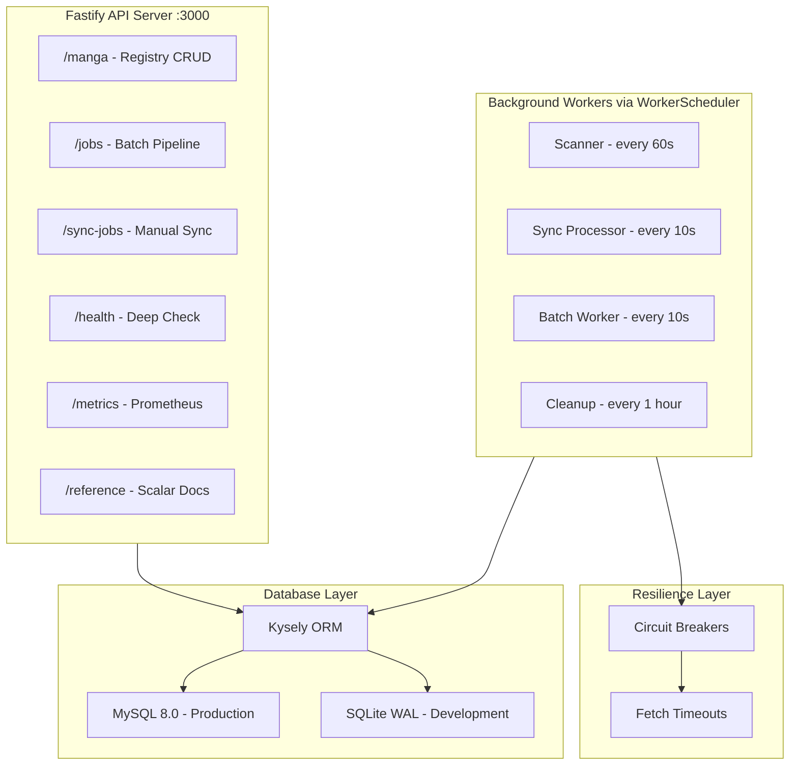

# Scraper Worker v2 - Ultra-Detailed Implementation Plan

## Critical Rules (READ FIRST)

**DO NOT:**

- Use `setInterval` anywhere - use `WorkerScheduler` class with `setTimeout` chain
- Use `console.log` - use Fastify's built-in Pino logger
- Hardcode configuration values - put everything in `src/config.ts`
- Make fetch calls without `AbortSignal.timeout()` - all external calls MUST have timeouts
- Use `any` type - define proper TypeScript interfaces in `src/types.ts`
- Skip error handling - wrap all async operations in try/catch

**MUST DO:**

- Use `fetchWithTimeout()` for ALL external API calls
- Use `CircuitBreaker` for ALL external service calls (scraper, uploader, backend)
- Check `isShuttingDown` flag before starting any new work in workers
- Use transactions for multi-step database operations
- Log with context: `log.info({ mangaId, chapterId }, 'message')`
- Use Zod schemas for ALL request validation

---

## Architecture




---

## Phase 1: Foundation

### Files to Create

1. **[package.json](package.json)** - Dependencies: fastify, @fastify/swagger, @scalar/fastify-api-reference, fastify-type-provider-zod, zod, kysely, better-sqlite3, mysql2, prom-client, @novu/node
2. **[src/config.ts](src/config.ts)** - ALL configuration values (ports, timeouts, intervals, API keys)
3. **[src/types.ts](src/types.ts)** - ALL TypeScript interfaces (MangaRegistry, MangaSyncTask, PipelineJob, etc.)
4. **[src/utils/fetch.ts](src/utils/fetch.ts)** - `fetchWithTimeout()` with `AbortSignal.timeout()`, `HttpError` class
5. **[src/utils/circuit-breaker.ts](src/utils/circuit-breaker.ts)** - `CircuitBreaker` class with closed/open/half-open states
6. **[src/workers/scheduler.ts](src/workers/scheduler.ts)** - `WorkerScheduler` class using `setTimeout` chain (NOT setInterval)
7. **[src/db/index.ts](src/db/index.ts)** - Kysely connection factory (MySQL prod, SQLite dev)
8. **[src/db/migrations/001_initial.ts](src/db/migrations/001_initial.ts)** - All table schemas
9. **[src/app.ts](src/app.ts)** - Fastify setup with Zod validation, Swagger, Scalar docs
10. **[src/index.ts](src/index.ts)** - Entry point with graceful shutdown (SIGTERM/SIGINT handlers)

### Key Code Patterns

**WorkerScheduler (NO setInterval):**

```typescript
private async tick() {
  if (this.isShuttingDown || this.isRunning) return;
  this.isRunning = true;
  try { await this.task(); } 
  finally { this.isRunning = false; this.scheduleTick(); }
}
private scheduleTick() {
  this.timeoutId = setTimeout(() => this.tick(), this.intervalMs);
}
```

**Graceful Shutdown:**

```typescript
async function shutdown(signal: string) {
  await fastify.close();
  await Promise.all([workers.scanner?.stop(), workers.processor?.stop()]);
  await closeDatabase();
  process.exit(0);
}
```

---

## Phase 2: Port Existing Routes

### Files to Create

1. **[src/routes/jobs.ts](src/routes/jobs.ts)** - `/jobs` CRUD with timeout fixes
2. **[src/routes/sync-jobs.ts](src/routes/sync-jobs.ts)** - `/sync-jobs` with backend pagination fix
3. **[src/routes/webhooks.ts](src/routes/webhooks.ts)** - Webhook handlers
4. **[src/db/repositories/jobs.ts](src/db/repositories/jobs.ts)** - Pipeline job queries
5. **[src/db/repositories/sync-jobs.ts](src/db/repositories/sync-jobs.ts)** - Sync job queries
6. **[src/schemas/jobs.ts](src/schemas/jobs.ts)** - Zod schemas for job validation

### Bug Fixes

- **Backend pagination**: Loop until all pages fetched (not just page 1)
- **Delete blocked**: Allow delete in any state (remove status check)
- **Fetch timeouts**: Use `fetchWithTimeout()` everywhere

---

## Phase 3: New Manga Registry

### Files to Create

1. **[src/routes/manga.ts](src/routes/manga.ts)** - `/manga` CRUD endpoints
2. **[src/db/repositories/manga.ts](src/db/repositories/manga.ts)** - Manga + sync tasks queries
3. **[src/workers/scanner.ts](src/workers/scanner.ts)** - Smart scanner with pagination
4. **[src/workers/sync-processor.ts](src/workers/sync-processor.ts)** - Task processor with atomic claiming
5. **[src/services/scraper.ts](src/services/scraper.ts)** - Scraper API client + circuit breaker
6. **[src/services/uploader.ts](src/services/uploader.ts)** - Uploader API client + circuit breaker
7. **[src/schemas/manga.ts](src/schemas/manga.ts)** - Zod schemas

### Atomic Task Claiming (MySQL)

```typescript
// SELECT FOR UPDATE SKIP LOCKED
const task = await trx.selectFrom('manga_sync_tasks')
  .where('status', '=', 'pending')
  .forUpdate().skipLocked()
  .executeTakeFirst();
```

### Smart Scanner Flow

1. Fetch page 1 only (100 chapters, ~3s)
2. Check if new chapters exist
3. If missing <= 100, filter page 1
4. If missing > 100, fetch more pages until range covered
5. Create sync tasks

---

## Phase 4: Observability

### Files to Create

1. **[src/routes/health.ts](src/routes/health.ts)** - Deep health check (DB, external services, workers, queues)
2. **[src/metrics.ts](src/metrics.ts)** - Prometheus metrics (prom-client)
3. **[src/services/novu.ts](src/services/novu.ts)** - Notifications with per-manga cooldown
4. **[src/services/cache.ts](src/services/cache.ts)** - Debounced cache purge
5. **[Dockerfile](Dockerfile)** - Multi-stage build
6. **[docker-compose.yml](docker-compose.yml)** - MySQL + app services

### Novu Payload Schema

```typescript
interface MangaSyncFailedPayload {
  manga_id: string;
  series_title: string;
  failure_type: 'scan_failed' | 'sync_failed' | 'partial_sync_failed';
  error_message: string;
  consecutive_failures: number;
  failed_tasks?: Array<{ chapter_number: number; error: string }>;
}
```

---

## Phase 5: Testing

### Files to Create

1. **[vitest.config.ts](vitest.config.ts)** - Test configuration
2. **[tests/setup.ts](tests/setup.ts)** - SQLite in-memory, msw setup
3. **[tests/mocks/handlers.ts](tests/mocks/handlers.ts)** - MSW handlers for external APIs
4. **[tests/unit/circuit-breaker.test.ts](tests/unit/circuit-breaker.test.ts)**
5. **[tests/unit/worker-scheduler.test.ts](tests/unit/worker-scheduler.test.ts)**
6. **[tests/integration/repositories/manga.test.ts](tests/integration/repositories/manga.test.ts)**
7. **[tests/integration/routes/manga.test.ts](tests/integration/routes/manga.test.ts)**

---

## Verification Checklist

After each phase, verify:

- `npm run typecheck` passes
- `npm run lint` passes
- `npm run test` passes
- Server starts without errors
- Graceful shutdown works (Ctrl+C)
- API docs accessible at `/reference`

---

## Full Implementation Details

See **[.cursor/plans/scraper_worker_v2_revised_18581f97.plan.md](.cursor/plans/scraper_worker_v2_revised_18581f97.plan.md)** for:

- Complete file contents for all 30+ files
- Exact code for each class and function
- Database schema DDL
- Docker configuration
- Test examples
- Common mistakes to avoid

