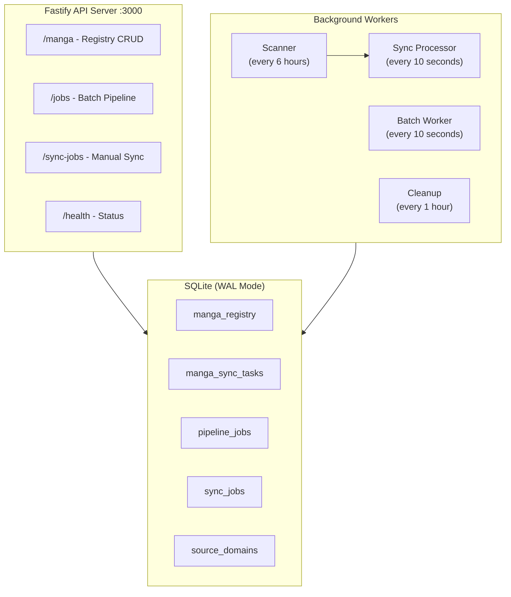

# Scraper Worker v2 - Final Plan

## Overview

Migrate from Cloudflare Workers to Node.js (Fastify + better-sqlite3). Build a simplified auto-sync system where manga registry is the single source of truth for status. Keep existing batch/sync pipelines for backward compatibility.

---

## Architecture




---

## Database Schema

### Table: `manga_registry` (Primary - Single Source of Truth)

```sql
CREATE TABLE manga_registry (
  id TEXT PRIMARY KEY,
  manga_id TEXT NOT NULL UNIQUE,          -- Backend manga UUID
  manga_url TEXT NOT NULL,                -- Full source URL
  source_domain TEXT NOT NULL,            -- e.g., "apkomik.cc"
  manga_slug TEXT NOT NULL,               -- e.g., "all-hail-the-sect-leader"
  series_title TEXT NOT NULL,
  
  -- Settings
  auto_sync_enabled INTEGER NOT NULL DEFAULT 1,
  check_interval_minutes INTEGER NOT NULL DEFAULT 360,
  priority INTEGER NOT NULL DEFAULT 0,
  
  -- Chapter Tracking (Source)
  source_chapter_count INTEGER NOT NULL DEFAULT 0,
  source_last_chapter REAL,               -- Highest chapter number
  
  -- Chapter Tracking (Backend)
  backend_chapter_count INTEGER NOT NULL DEFAULT 0,
  backend_last_chapter REAL,
  
  -- Sync Status (THE status field for UI)
  status TEXT NOT NULL DEFAULT 'idle',
  -- idle | scanning | syncing | error
  
  sync_progress_total INTEGER NOT NULL DEFAULT 0,
  sync_progress_completed INTEGER NOT NULL DEFAULT 0,
  sync_progress_failed INTEGER NOT NULL DEFAULT 0,
  
  -- Timestamps
  last_scanned_at TEXT,
  last_synced_at TEXT,
  next_scan_at TEXT,
  
  -- Error Tracking
  last_error TEXT,
  last_error_at TEXT,
  consecutive_failures INTEGER NOT NULL DEFAULT 0,
  
  created_at TEXT NOT NULL DEFAULT (datetime('now')),
  updated_at TEXT NOT NULL DEFAULT (datetime('now'))
);

CREATE UNIQUE INDEX idx_manga_registry_manga_id ON manga_registry(manga_id);
CREATE INDEX idx_manga_registry_domain_slug ON manga_registry(source_domain, manga_slug);
CREATE INDEX idx_manga_registry_scan ON manga_registry(auto_sync_enabled, next_scan_at);
CREATE INDEX idx_manga_registry_status ON manga_registry(status);
```

### Table: `manga_sync_tasks` (Internal - Not Exposed via API)

```sql
CREATE TABLE manga_sync_tasks (
  id TEXT PRIMARY KEY,
  manga_registry_id TEXT NOT NULL,
  
  chapter_url TEXT NOT NULL,
  chapter_number REAL NOT NULL,
  weight INTEGER NOT NULL DEFAULT 0,
  
  status TEXT NOT NULL DEFAULT 'pending',
  -- pending | scraping | scraped | uploading | completed | failed | skipped
  
  zip_url TEXT,                           -- Idempotency: skip scrape if exists
  error TEXT,
  retry_count INTEGER NOT NULL DEFAULT 0,
  
  created_at TEXT NOT NULL DEFAULT (datetime('now')),
  updated_at TEXT NOT NULL DEFAULT (datetime('now')),
  
  FOREIGN KEY (manga_registry_id) REFERENCES manga_registry(id) ON DELETE CASCADE
);

CREATE INDEX idx_sync_tasks_manga ON manga_sync_tasks(manga_registry_id);
CREATE INDEX idx_sync_tasks_status ON manga_sync_tasks(manga_registry_id, status, weight);
```

### Table: `source_domains` (Per-Domain Rate Limits)

```sql
CREATE TABLE source_domains (
  domain TEXT PRIMARY KEY,
  delay_between_chapters_ms INTEGER NOT NULL DEFAULT 1000,
  max_concurrent_chapters INTEGER NOT NULL DEFAULT 3,
  is_active INTEGER NOT NULL DEFAULT 1,
  notes TEXT,
  created_at TEXT NOT NULL DEFAULT (datetime('now')),
  updated_at TEXT NOT NULL DEFAULT (datetime('now'))
);
```

### Existing Tables (Keep for Backward Compatibility)

- `pipeline_jobs` - Batch download jobs (unchanged)
- `sync_jobs` + `sync_chapter_tasks` - Manual sync with weight range (unchanged)

---

## API Endpoints

### `/manga` - Manga Registry (Primary)


| Method | Endpoint                | Description                                   |
| ------ | ----------------------- | --------------------------------------------- |
| POST   | `/manga`                | Register manga for auto-sync                  |
| GET    | `/manga`                | List all manga (table view with status)       |
| GET    | `/manga/:id`            | Get manga details + failed tasks              |
| PUT    | `/manga/:id`            | Update settings (interval, enabled, priority) |
| DELETE | `/manga/:id`            | Remove from registry + cancel active sync     |
| POST   | `/manga/:id/force-scan` | Trigger immediate scan                        |
| POST   | `/manga/:id/retry`      | Retry failed tasks immediately                |
| POST   | `/manga/bulk`           | Register multiple manga                       |
| PUT    | `/manga/update-domain`  | Bulk domain migration                         |


### `/jobs` - Batch Pipeline (Keep Existing)


| Method | Endpoint          | Description                           |
| ------ | ----------------- | ------------------------------------- |
| POST   | `/jobs`           | Create batch job                      |
| GET    | `/jobs`           | List jobs                             |
| GET    | `/jobs/:id`       | Get job details                       |
| DELETE | `/jobs/:id`       | Cancel job (NOW ALLOWED IN ANY STATE) |
| POST   | `/jobs/:id/retry` | Retry failed job                      |


### `/sync-jobs` - Manual Sync (Keep Existing)


| Method | Endpoint               | Description                           |
| ------ | ---------------------- | ------------------------------------- |
| POST   | `/sync-jobs`           | Create sync job with weight range     |
| GET    | `/sync-jobs`           | List jobs                             |
| GET    | `/sync-jobs/:id`       | Get job details                       |
| DELETE | `/sync-jobs/:id`       | Cancel job (NOW ALLOWED IN ANY STATE) |
| POST   | `/sync-jobs/:id/retry` | Retry failed chapters                 |


### `/health` - Enhanced Health Check


| Method | Endpoint  | Description        |
| ------ | --------- | ------------------ |
| GET    | `/health` | Full system status |


---

## Request/Response Examples

### POST `/manga` - Register Manga

**Request:**

```json
{
  "manga_url": "https://apkomik.cc/manga/all-hail-the-sect-leader/",
  "manga_id": "f97c11a5-f544-4a98-bcf9-9ea10abc9565",
  "series_title": "All Hail The Sect Leader",
  "check_interval_minutes": 360,
  "priority": 0
}
```

**Response (201):**

```json
{
  "success": true,
  "data": {
    "id": "uuid-1",
    "manga_id": "f97c11a5-...",
    "manga_url": "https://apkomik.cc/manga/all-hail-the-sect-leader/",
    "source_domain": "apkomik.cc",
    "manga_slug": "all-hail-the-sect-leader",
    "series_title": "All Hail The Sect Leader",
    "status": "idle",
    "auto_sync_enabled": true,
    "check_interval_minutes": 360
  }
}
```

### GET `/manga` - List Manga (Table View)

**Response:**

```json
{
  "success": true,
  "data": {
    "manga": [
      {
        "id": "uuid-1",
        "manga_id": "f97c11a5-...",
        "series_title": "All Hail The Sect Leader",
        "source_domain": "apkomik.cc",
        "source_chapter_count": 150,
        "backend_chapter_count": 148,
        "source_last_chapter": 150,
        "backend_last_chapter": 148,
        "status": "syncing",
        "sync_progress": { "total": 2, "completed": 1, "failed": 0 },
        "last_scanned_at": "2026-02-21T10:00:00Z",
        "last_error": null,
        "auto_sync_enabled": true
      }
    ],
    "total": 500,
    "page": 1,
    "page_size": 20
  }
}
```

### GET `/manga/:id` - Manga Details (with failed tasks)

**Response:**

```json
{
  "success": true,
  "data": {
    "id": "uuid-1",
    "manga_id": "f97c11a5-...",
    "manga_url": "https://apkomik.cc/manga/all-hail-the-sect-leader/",
    "source_domain": "apkomik.cc",
    "manga_slug": "all-hail-the-sect-leader",
    "series_title": "All Hail The Sect Leader",
    "source_chapter_count": 150,
    "backend_chapter_count": 147,
    "source_last_chapter": 150,
    "backend_last_chapter": 147,
    "status": "error",
    "sync_progress": { "total": 3, "completed": 1, "failed": 2 },
    "last_scanned_at": "2026-02-21T10:00:00Z",
    "last_synced_at": "2026-02-21T08:00:00Z",
    "next_scan_at": "2026-02-21T16:00:00Z",
    "last_error": "2 chapter(s) failed",
    "consecutive_failures": 1,
    "auto_sync_enabled": true,
    "check_interval_minutes": 360,
    "priority": 0,
    "failed_tasks": [
      {
        "chapter_number": 149,
        "chapter_url": "https://apkomik.cc/...-chapter-149/",
        "error": "Scraper timeout after 60s",
        "retry_count": 2
      },
      {
        "chapter_number": 150,
        "chapter_url": "https://apkomik.cc/...-chapter-150/",
        "error": "Uploader returned 503",
        "retry_count": 1
      }
    ]
  }
}
```

### POST `/manga/:id/force-scan`

**Response (202):**

```json
{
  "success": true,
  "message": "Force scan started",
  "data": { "status": "scanning" }
}
```

**Error (409 - already syncing):**

```json
{
  "success": false,
  "error": "Manga is already syncing. Use /retry to retry failed tasks."
}
```

### POST `/manga/:id/retry`

**Response:**

```json
{
  "success": true,
  "message": "Retrying 2 failed task(s)",
  "data": { "retrying": [149, 150], "status": "syncing" }
}
```

---

## Processing Flow

### Scanner (Every 6 Hours Default)

```
1. Get manga where:
   - auto_sync_enabled = 1
   - status = 'idle'
   - next_scan_at <= NOW()
   
2. For each manga (p-limit = 5 concurrent):
   a. Set status = 'scanning'
   b. Fetch source chapter list from Scraper API
   c. Update source_chapter_count, source_last_chapter
   d. Fetch backend chapter list (with pagination!)
   e. Update backend_chapter_count, backend_last_chapter
   f. Compare: find missing chapter numbers
   g. If missing chapters:
      - Create manga_sync_tasks for each
      - Set status = 'syncing', update sync_progress
   h. If no missing:
      - Set status = 'idle', update last_synced_at
   i. Update last_scanned_at, next_scan_at
   j. On error: Set status = 'error', increment consecutive_failures
```

### Sync Processor (Every 10 Seconds)

```
1. Get manga where status = 'syncing' (p-limit = 5 concurrent)

2. For each manga:
   a. Get domain config for rate limiting
   b. Get pending tasks (p-limit = per-domain max_concurrent)
   c. For each task:
      - Check if chapter exists in backend (idempotency)
      - If exists: mark skipped
      - If zip_url exists: skip scraping
      - Scrape -> Zip -> Upload -> Create Chapter
      - On success: mark completed, update sync_progress
      - On failure: 
        - If retry_count < 3: mark pending, increment retry_count
        - If retry_count >= 3: mark failed, update sync_progress
   d. Check if all tasks done:
      - If all completed: status = 'idle', reset consecutive_failures
      - If any failed: status = 'error', set last_error
      - Update last_synced_at
```

### Force Scan Behavior

```
POST /manga/:id/force-scan

1. If status = 'syncing':
   - Return 409 "Already syncing, use /retry"
   
2. If status = 'scanning':
   - Return 409 "Already scanning"
   
3. If status = 'idle' or 'error':
   - Delete any existing failed tasks
   - Set status = 'scanning'
   - Add to scanner queue (processed immediately)
```

### Retry Behavior

```
POST /manga/:id/retry

1. If status != 'error':
   - Return 400 "No failed tasks to retry"
   
2. Reset failed tasks:
   - UPDATE manga_sync_tasks SET status = 'pending', retry_count = 0
     WHERE manga_registry_id = ? AND status = 'failed'
   
3. Set status = 'syncing'
4. Return count of tasks being retried
```

---

## Configuration

```typescript
const CONFIG = {
  // Server
  PORT: 3000,
  LOG_LEVEL: 'info', // 'debug' in development
  
  // Database
  DATABASE_PATH: './data/scraper.db',
  
  // Scheduler Intervals
  SCANNER_INTERVAL_MS: 60000,        // Check for due scans every 1 min
  PROCESSOR_INTERVAL_MS: 10000,      // Process tasks every 10 sec
  BATCH_WORKER_INTERVAL_MS: 10000,   // Batch pipeline every 10 sec
  CLEANUP_INTERVAL_MS: 3600000,      // Cleanup every 1 hour
  
  // Concurrency
  MAX_CONCURRENT_SCANS: 5,           // Manga being scanned in parallel
  MAX_CONCURRENT_SYNCS: 5,           // Manga being synced in parallel
  DEFAULT_CHAPTERS_PER_MANGA: 3,     // Default concurrent chapters
  
  // Batch Pipeline (existing)
  MAX_CONCURRENT_SCRAPE: 5,
  MAX_CONCURRENT_UPLOAD: 5,
  
  // Sync Pipeline (existing)
  MAX_CONCURRENT_SYNC_JOBS: 3,
  MAX_CONCURRENT_SYNC_CHAPTERS: 3,
  
  // Timeouts
  FETCH_TIMEOUT_MS: 30000,           // 30s for API calls
  SCRAPE_TIMEOUT_MS: 60000,          // 60s for scraping
  UPLOAD_TIMEOUT_MS: 120000,         // 120s for upload
  
  // Retry
  MAX_TASK_RETRIES: 3,               // Max retries per task
  RETRY_DELAY_MS: 5000,              // 5s between retries
  
  // Notifications
  NOTIFY_AFTER_FAILURES: 3,          // Notify after 3 consecutive failures
  NOTIFICATION_COOLDOWN_MS: 3600000, // 1 hour between notifications
  
  // Cleanup
  JOB_TTL_DAYS: 7,                   // Delete old jobs after 7 days
};
```

---

## Critical Bug Fixes


| Bug                | Current Behavior             | Fix                                       |
| ------------------ | ---------------------------- | ----------------------------------------- |
| No fetch timeouts  | Hung API blocks forever      | AbortController with configurable timeout |
| Backend pagination | Only fetches page 1          | Loop until all pages fetched              |
| Delete blocked     | Can't cancel processing jobs | Allow delete in any state                 |
| Race conditions    | Two workers pick same task   | Optimistic locking in transaction         |
| Cache purge spam   | Purge after every chapter    | Debounce: once per tick cycle             |
| Stale tasks        | Stuck in scraping/uploading  | Recovery on startup                       |
| No retry limit     | Tasks retry forever          | Max 3 retries, then mark failed           |


---

## Stale Recovery (On Startup)

```typescript
function recoverStaleTasks(db: Database) {
  // 1. Reset stuck tasks
  db.prepare(`
    UPDATE manga_sync_tasks 
    SET status = CASE 
      WHEN zip_url IS NOT NULL THEN 'scraped' 
      ELSE 'pending' 
    END,
    updated_at = datetime('now')
    WHERE status IN ('scraping', 'uploading')
  `).run();
  
  // 2. Reset stuck manga status
  db.prepare(`
    UPDATE manga_registry 
    SET status = CASE
      WHEN (SELECT COUNT(*) FROM manga_sync_tasks 
            WHERE manga_registry_id = manga_registry.id 
            AND status IN ('pending', 'scraped')) > 0 
      THEN 'syncing'
      WHEN (SELECT COUNT(*) FROM manga_sync_tasks 
            WHERE manga_registry_id = manga_registry.id 
            AND status = 'failed') > 0 
      THEN 'error'
      ELSE 'idle'
    END,
    updated_at = datetime('now')
    WHERE status IN ('scanning', 'syncing')
  `).run();
  
  // 3. Same for existing sync_chapter_tasks and pipeline_jobs
  // ...
  
  log.info('Recovered stale tasks on startup');
}
```

---

## Implementation Order

### Phase 1: Foundation

1. Initialize Fastify + TypeScript + better-sqlite3
2. Setup WAL mode, create all tables
3. Implement stale recovery
4. Setup graceful shutdown

### Phase 2: Port Existing

1. Port `/jobs` routes (batch pipeline)
2. Port `/sync-jobs` routes (manual sync)
3. Port webhook handlers
4. Add fetch timeouts everywhere
5. Fix backend pagination
6. Fix delete endpoint (allow any state)

### Phase 3: Auto-Sync

1. Implement `/manga` CRUD endpoints
2. Implement scanner worker
3. Implement sync processor worker
4. Implement force-scan and retry
5. Add per-domain rate limiting

### Phase 4: Polish

1. Integrate Novu notifications
2. Add notification rate limiting
3. Implement debounced cache purge
4. Create Docker + docker-compose
5. Update API documentation

---

## Project Structure

```
src/
├── index.ts                 # Entry point, startup, shutdown
├── app.ts                   # Fastify setup, plugins, routes
├── config.ts                # All configuration
├── db/
│   ├── index.ts             # better-sqlite3 connection, WAL
│   ├── schema.sql           # All table definitions
│   └── repositories/
│       ├── manga.ts         # manga_registry + manga_sync_tasks
│       ├── jobs.ts          # pipeline_jobs
│       ├── sync-jobs.ts     # sync_jobs + sync_chapter_tasks
│       └── domains.ts       # source_domains
├── routes/
│   ├── manga.ts             # /manga endpoints
│   ├── jobs.ts              # /jobs endpoints
│   ├── sync-jobs.ts         # /sync-jobs endpoints
│   ├── health.ts            # /health endpoint
│   └── webhooks.ts          # Webhook handlers
├── workers/
│   ├── scheduler.ts         # Main tick loop
│   ├── scanner.ts           # Manga scanner
│   ├── sync-processor.ts    # Task processor
│   ├── batch-worker.ts      # Batch pipeline
│   └── cleanup.ts           # Old job cleanup
├── services/
│   ├── scraper.ts           # Scraper API client
│   ├── uploader.ts          # Uploader API client
│   ├── backend.ts           # Backend API client
│   ├── cache.ts             # Cache purge (debounced)
│   └── novu.ts              # Notifications
├── utils/
│   ├── fetch.ts             # fetchWithTimeout
│   ├── retry.ts             # withRetry
│   ├── chapter.ts           # extractChapterNumber
│   └── url.ts               # extractMangaSlug, buildMangaUrl
├── schemas/                 # Zod validation schemas
│   ├── manga.ts
│   ├── jobs.ts
│   └── sync-jobs.ts
└── types.ts                 # TypeScript interfaces
```

---

## Docker Setup

```dockerfile
FROM node:20-alpine AS builder
WORKDIR /app
COPY package*.json ./
RUN npm ci
COPY . .
RUN npm run build

FROM node:20-alpine
WORKDIR /app
COPY --from=builder /app/dist ./dist
COPY --from=builder /app/node_modules ./node_modules
COPY --from=builder /app/package.json ./
RUN mkdir -p /app/data
ENV NODE_ENV=production
EXPOSE 3000
CMD ["node", "dist/index.js"]
```

```yaml
# docker-compose.yml
version: '3.8'
services:
  scraper-worker:
    build: .
    ports:
      - "3000:3000"
    volumes:
      - ./data:/app/data
    environment:
      - NODE_ENV=production
      - DATABASE_PATH=/app/data/scraper.db
      - SCRAPER_BASE_URL=${SCRAPER_BASE_URL}
      - UPLOADER_BASE_URL=${UPLOADER_BASE_URL}
      - BACKEND_API_URL=${BACKEND_API_URL}
      - CACHE_PURGE_URL=${CACHE_PURGE_URL}
      - ADMIN_API_KEY=${ADMIN_API_KEY}
      - UPLOADER_API_KEY=${UPLOADER_API_KEY}
      - BACKEND_API_KEY=${BACKEND_API_KEY}
      - CACHE_PURGE_API_KEY=${CACHE_PURGE_API_KEY}
      - NOVU_API_KEY=${NOVU_API_KEY}
    restart: unless-stopped
    healthcheck:
      test: ["CMD", "wget", "-q", "--spider", "http://localhost:3000/health"]
      interval: 30s
      timeout: 10s
      retries: 3
```

